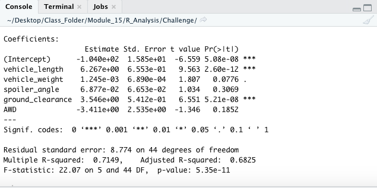
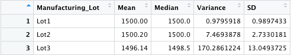

# MechaCar_Statistical_Analysis

## Linear Regression to Predict MPG

Which variables/coefficients provided a non-random amount of variance to the mpg values in the dataset?
- The linear regression shows that Intercept, vehicle_length and ground_clearance provided a non-random amount of variance to the mpg values in the dataset. 

Is the slope of the linear model considered to be zero? Why or why not?
- The r-squared value is 0.72 which means that more than half of mpg predictions will be correct when using this linear model. In addition, the p-value of our linear regression analysis is 5.35e-11, which is smaller than our assumed significance level of 0.05%. Therefore, we can state that there is sufficient evidence to reject our null hypothesis, which means that the slope of our linear model is not zero.

Does this linear model predict mpg of MechaCar prototypes effectively? Why or why not?
- Yes, the linear model will correctly preditc the mpg of MecharCar prototypes 72% of the time.  This is indicated by the r-squared value which is 0.72.

## Summary Statistics on Suspension Coils

LOT SUMMARY

TOTAL SUMMARY

The design specifications for the MechaCar suspension coils dictate that the variance of the suspension coils must not exceed 100 pounds per square inch. Does the current manufacturing data meet this design specification for all manufacturing lots in total and each lot individually? Why or why not?
- The current manufacturing data indiates that all lots in total do meet the design specifications, however not all lots individually meet the requirements.  This is because Lot 3 has a variance of 170.29 pounds per square inch.  Lots 1 and 2 both do meet the design specifications, with variances of .98 pounds per square inch and 7.47 pounds per square inch respectively.
